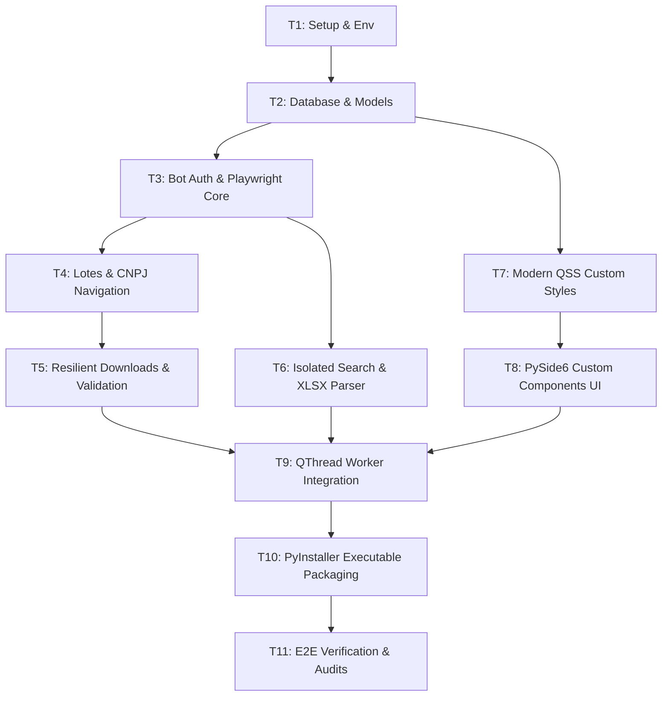

# PLAN-sat-xml-downloader.md — Automação SEFAZ/SP SAT XML Downloader

Este documento orienta o desenvolvimento passo a passo do robô de download e busca de cupons fiscais SAT do portal SEFAZ/SP. Ele serve como o guia mestre executável para o desenvolvimento modular e verificação contínua.

---

## 📋 Overview
*   **Nome do Projeto:** Sistema de Busca e Download de XML SAT em Lote
*   **Objetivo:** Robô resiliente com UI em PySide6 e automação via Playwright que extrai XMLs de CF-e e armazena os dados no SQL Server com persistência local de progresso.
*   **Tipo de Projeto:** **WEB/BACKEND + DESKTOP**
    *   **Agente Lider de Backend:** `backend-specialist` (para o motor do Playwright e integrações SQLAlchemy)
    *   **Agente Líder de UI/UX:** `frontend-specialist` (para estilização QSS moderna e janelas PySide6)
    *   **Agente Líder de Persistência:** `database-architect` (para a camada de modelagem SQL Server)

---

## 🏆 Success Criteria
1.  **Conexão Segura e Mapeamento DB:** Conectar com sucesso ao banco SQL Server local, criando as 4 tabelas relacionais (`SAT_Config`, `SAT_Cfe`, `SAT_CfeItem`, `SAT_QueueProgress`) de maneira auto-gerada.
2.  **Autenticação Resiliente:** Efetuar login via e-CNPJ (certificado digital do Windows) em modo headful e, a partir de então, realizar as buscas em background.
3.  **Fatiamento Automático de Período:** Dividir períodos de datas arbitrariamente longos informados pelo usuário em pacotes de no máximo 2 dias.
4.  **Recuperação Resiliente de Queda de Sessão:** Caso o robô perca o contexto de download e seja jogado na Home do portal, ele deve se re-posicionar automaticamente na página correta em até 3 retentativas sem travar ou duplicar downloads.
5.  **Validação de Download de XML:** Validar que o XML físico baixado é íntegro, maior que 0 bytes, de formato XML válido, renomeando-o para a `CHAVE.xml` na estrutura `/CNPJ/ANO/MES/DIA/`.
6.  **Carga Completa de Busca Isolada:** Ler planilha XLSX com chaves de acesso, buscar de forma unitária, e persistir cabeçalho e todos os itens do produto detalhadamente no banco de dados.
7.  **Interface Gráfica Premium:** Dashboard dark modernizado em PySide6 que não bloqueia a UI (utilizando `QThread` / `QObject` e sinais assíncronos) com console de logs rolando em tempo real.

---

## 🛠️ Tech Rationale
*   **Python 3.11+:** Robustez de scripts, excelente suporte a Playwright assíncrono e ecossistema de dados.
*   **PySide6 (Qt for Python):** Fornece UI nativa de alta performance. Mantém o projeto puramente em Python, otimizando o tamanho do empacotamento `.EXE` final se comparado ao Electron (que exige embutir Node.js + Chromium + Python API).
*   **Playwright (Async):** Rápido, leve, excelente controle de fluxos de rede, tratamento robusto de arquivos baixados de forma assíncrona, tolerância alta a elementos dinâmicos do ASP.NET.
*   **SQLAlchemy + PyODBC (SQL Server):** Camada ORM robusta compatível com o banco especificado (`127.0.0.1`, porta `1433`).
*   **Cryptography (Fernet):** Encriptação simétrica local para salvar as senhas e strings de conexão no banco ou arquivo local com chave protegida pelo Windows Keyring.

---

## 📁 File Structure
```plaintext
/baixaDeXmls
├── app.py                      # Ponto de entrada da aplicação desktop PySide6
├── requirements.txt            # Dependências de bibliotecas
├── /config
│   ├── __init__.py
│   └── settings.py             # Configurações locais, criptografia AES e gerenciamento de caminhos
├── /database
│   ├── __init__.py
│   ├── connection.py           # Gestor de conexões SQLAlchemy & Pool PyODBC
│   └── models.py               # Modelos relacionais SQL Server (Cfe, CfeItem, AppConfig)
├── /backend
│   ├── __init__.py
│   ├── sat_bot.py              # Motor principal Playwright de automação em lote
│   ├── sat_bot_isolated.py     # Robô de consulta e extração unitária por XLSX
│   └── state_manager.py        # Fila persistente de itens e auto-recuperação (Resiliência)
├── /frontend
│   ├── __init__.py
│   ├── styles.css              # QSS moderno em Dark Mode (Paleta Slate + Emerald Green)
│   ├── main_window.py          # Frame principal e chaveamento de Tabs
│   └── components/
│       ├── __init__.py
│       ├── dashboard_tab.py    # Painel inicial de progresso, gráficos e logs
│       ├── batch_tab.py        # Configurações e formulário de lote de CNPJs
│       ├── isolated_tab.py     # Upload XLSX e status de chaves buscadas
│       └── settings_tab.py     # Configurações do Banco, caminhos de download e Proxy
└── /logs                       # Logs estruturados por data
```

---

## 📝 Task Breakdown



### 🔴 PHASE 1: FOUNDATION (P0)

#### Task 1: Setup & Env
*   **Agente:** `backend-specialist`
*   **Skills:** `clean-code`, `python-patterns`
*   **Prioridade:** P0
*   **Dependências:** Nenhuma
*   **INPUT:** Requisitos de bibliotecas (`requirements.txt`, `.env.example`).
*   **OUTPUT:** Ambiente Python virtual configurado, arquivo `requirements.txt` com todas as versões travadas e `.env.example` preenchido.
*   **VERIFY:** Executar `pip install -r requirements.txt` e validar que as dependências principais (`PySide6`, `playwright`, `SQLAlchemy`, `pyodbc`, `pandas`, `openpyxl`, `cryptography`, `python-dotenv`) foram instaladas com sucesso.

#### Task 2: Database & Models
*   **Agente:** `database-architect`
*   **Skills:** `database-design`
*   **Prioridade:** P0
*   **Dependências:** Task 1
*   **INPUT:** Requisitos de tabelas e campos do SQL Server do usuário.
*   **OUTPUT:** `/database/connection.py` e `/database/models.py`.
*   **VERIFY:** Escrever um script temporário que tenta abrir a conexão usando SQLAlchemy e PyODBC com o banco informado e executa `Base.metadata.create_all(engine)`. Validar no SQL Server Management Studio (SSMS) a criação das tabelas `SAT_Config`, `SAT_Cfe`, `SAT_CfeItem` e `SAT_QueueProgress`.

---

### 🔴 PHASE 2: AUTOMATION BACKEND (P1)

#### Task 3: Bot Auth & Playwright Core
*   **Agente:** `backend-specialist`
*   **Skills:** `webapp-testing`, `python-patterns`
*   **Prioridade:** P1
*   **Dependências:** Task 2
*   **INPUT:** URL do Portal SAT SEFAZ/SP.
*   **OUTPUT:** `/backend/sat_bot.py` (métodos de inicialização e autenticação via certificado e-CNPJ do Windows em modo Headful).
*   **VERIFY:** Rodar um teste Playwright local que abre a tela de Login SSL da SEFAZ, aciona o botão de Login por Certificado Digital Contribuinte, aguarda o login com sucesso no sistema e exibe no console a URL logada (geralmente `Home.aspx`).

#### Task 4: Lotes & CNPJ Navigation
*   **Agente:** `backend-specialist`
*   **Skills:** `webapp-testing`
*   **Prioridade:** P1
*   **Dependências:** Task 3
*   **INPUT:** Lista de CNPJs e datas arbitrárias.
*   **OUTPUT:** Funções de conversão de datas em intervalos de 2 dias, alternância do CNPJ ativo e captura automática dos números de série SAT no portal.
*   **VERIFY:** Validar que o fatiador retorna listas exatas de períodos curtos. Simular a troca de CNPJ e verificar se o robô reconhece e clica nos botões de mudança de representação de contribuinte no painel SAT.

#### Task 5: Resilient Downloads & Validation
*   **Agente:** `debugger`
*   **Skills:** `systematic-debugging`, `webapp-testing`
*   **Prioridade:** P1
*   **Dependências:** Task 4
*   **INPUT:** Fila de cupons disponíveis no menu "Consulta Lotes Enviados".
*   **OUTPUT:** Fluxo de download robusto, verificador de integridade física dos XMLs, renomeador de chaves, estrutura organizada `/downloads/CNPJ/ANO/MES/DIA/` e o mecanismo vital de auto-recuperação pós-redirecionamento à Home.
*   **VERIFY:** Rodar um teste de lote que, no meio de uma iteração de download de página de cupons, é forçado a voltar para a Home de forma programática. O robô deve detectar o redirecionamento, refazer o fluxo de filtros e continuar a baixar os itens pendentes sem duplicidade.

#### Task 6: Isolated Search & XLSX Parser
*   **Agente:** `backend-specialist`
*   **Skills:** `python-patterns`, `webapp-testing`
*   **Prioridade:** P1
*   **Dependências:** Task 3
*   **INPUT:** Arquivo XLSX com chaves de acesso.
*   **OUTPUT:** `/backend/sat_bot_isolated.py` com leitor Pandas/OpenPyXL, validações de chaves (DV, formato), navegação para "Consultar CFe Sem Erros" e inserção relacional (Cabeçalho e Produtos detalhados) no banco.
*   **VERIFY:** Processar uma planilha teste. O robô deve coletar a chave, buscar na SEFAZ, extrair o cabeçalho e todas as colunas de produtos expostas na página HTML e inserir nas tabelas `SAT_Cfe` e `SAT_CfeItem` garantindo a integridade referencial.

---

### 🔴 PHASE 3: MODERN USER INTERFACE (P2)

#### Task 7: Modern QSS Custom Styles
*   **Agente:** `frontend-specialist`
*   **Skills:** `frontend-design`, `ui-ux-pro-max`
*   **Prioridade:** P2
*   **Dependências:** Task 1
*   **INPUT:** Manual de Estilo Dark Mode Premium da IDE.
*   **OUTPUT:** `/frontend/styles.css` contendo as regras QSS baseadas em cores de HSL modernas (Fundo `#0f172a`, Detalhes `#10b981`, Azure `#3b82f6`). **Banimento de Roxo e Violeta aplicado.**
*   **VERIFY:** Validar o arquivo QSS garantindo que não contém nenhum código hexadecimal ou HSL que remeta a tons roxos ou violetas.

#### Task 8: PySide6 Custom Components UI
*   **Agente:** `frontend-specialist`
*   **Skills:** `frontend-design`
*   **Prioridade:** P2
*   **Dependências:** Task 7
*   **INPUT:** Estrutura de Tabs (Dashboard, Lote, Isolada, Configurações).
*   **OUTPUT:** `/frontend/main_window.py` e os arquivos do diretório `/frontend/components/`.
*   **VERIFY:** Executar a interface gráfica principal e interagir com as abas. Verificar a responsividade ao redimensionar a janela e a consistência visual das tabelas, inputs e botões.

#### Task 9: QThread Worker Integration
*   **Agente:** `backend-specialist`
*   **Skills:** `python-patterns`
*   **Prioridade:** P2
*   **Dependências:** Task 5, Task 6, Task 8
*   **INPUT:** Integração assíncrona entre UI e robôs Playwright.
*   **OUTPUT:** Integração baseada em `QThread` e `QObject` que realiza o despacho dos robôs em lote e isolados em threads de background, transmitindo progresso, contador de downloads, erros e logs via Qt Signals para a interface sem congelá-la.
*   **VERIFY:** Iniciar a busca em lote. O robô deve iniciar a automação em background e o painel de logs da UI deve receber logs em tempo real sem travar a interface do usuário para cliques ou rolagem de página.

---

### 🔴 PHASE 4: COMPILATION & VERIFICATION (P3)

#### Task 10: PyInstaller Executable Packaging
*   **Agente:** `devops-engineer`
*   **Skills:** `deployment-procedures`
*   **Prioridade:** P3
*   **Dependências:** Task 9
*   **INPUT:** Estrutura completa do código fonte do robô.
*   **OUTPUT:** Arquivo de especificação `build.spec` e executável `.exe` instalável compilado contendo todas as dependências e o navegador Playwright portátil.
*   **VERIFY:** Executar o script de compilação via PyInstaller. Testar o executável gerado em um ambiente limpo (sem Python instalado) e garantir que a aplicação abre e funciona perfeitamente.

#### Task 11: E2E Verification & Audits
*   **Agente:** `test-engineer`
*   **Skills:** `testing-patterns`, `webapp-testing`
*   **Prioridade:** P3
*   **Dependências:** Task 10
*   **INPUT:** Scripts de checagem mestre (`checklist.py`, `verify_all.py`).
*   **OUTPUT:** Relatório de auditoria UX, segurança de segredos local, cobertura de testes unitários e walkthrough final.
*   **VERIFY:** Rodar `python .agent/scripts/checklist.py .` e obter 100% de sucesso.

---

## 🏁 Phase X: Verification Suite

Para finalizar o projeto, as seguintes etapas automatizadas devem ser executadas com sucesso:

1.  **Checagem de Código e Segurança:**
    ```bash
    python .agent/skills/vulnerability-scanner/scripts/security_scan.py .
    ```
2.  **Checagem Visual de Conformidade UI/UX:**
    *   Validar se o visual não utiliza cores roxas/violetas.
    *   Garantir contrastes de acessibilidade adequados.
3.  **Auditoria Manual e Resiliência:**
    *   Testar perda de conexão de internet simulada (desconectar o Wi-Fi e validar se o robô aguarda o re-estabelecimento de forma inteligente).
    *   Testar arquivo XLSX corrompido ou mal formatado.

## ✅ PHASE X COMPLETE
*   Status: Em Planejamento
*   Data: 27 de Maio de 2026
